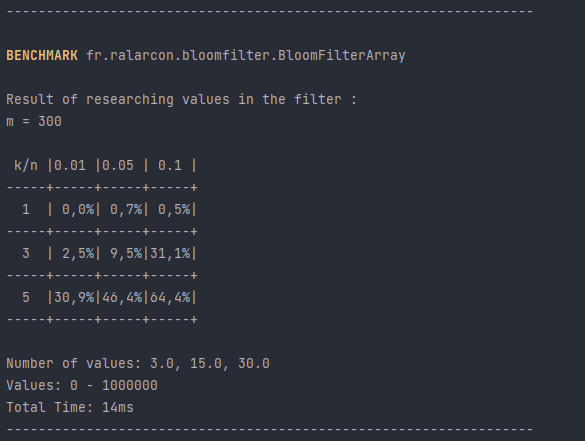

# Rapport d'implémentation d'un Filtre de Bloom

## Sommaire
- [Description](#filtre-de-bloom)
- [Statut du projet](#statut-du-projet)
- [Implémentation](#implmentation)
- [Benchmark](#benchmark)
- [Conclusion](#conclusion)
- [Sources](#sources)

 

## Filtre de Bloom

<i>« Un filtre de Bloom est une structure de données permettant de façon efficace de tester la présence
ou non d’un élément dans le filtre. En particulier, le filtre de Bloom permet de tester :
-  avec certitude : l'absence d'un élément (si le test indique que le filtre ne contient pas une
valeur, alors il ne la contient pas)
-  avec une certaine probabilité : la présence d'un élément (si le test indique que le filtre
contient une valeur, il peut se tromper avec une certaine probabilité)

Un filtre de Bloom est constitué d’un tableau de bits (ou de booléens) de m cases et de k fonctions
de hachage. Chacune de ses k fonctions de hachage associe, à chaque élément à stocker, un indice
dans le tableau (donc entre 0 et m-1). »</i>

 

## Statut du projet
### Avancement 

#### Implémentation des différentes variantes du filtre en utilisant trois types de structure de données
- [x] Simple tableau (<code>int[]</code>)
- [x] ArrayList
- [x] LinkedList

#### Benchmarking (Banc d'essai)
- [x] Banc d'essai temps d'execution
- [x] Banc d'essai taux de faux positif
- [x] Analyse des résultats

#### Autres
- [x] Documentation
- [x] Nettoyage et optimisation
- [x] Dernières vérifications

### Statut global

## Implémentation

### Structure du code Java (diagramme de classes UML)

## Benchmark

Afin d'obtenir des résultats exploitables et précis, j'ai choisi de mettre l'accent sur la visualisation des données résultant du benchmarking.
Le but final étant d'effectuer une comparaison des temps d'exécution entre les trois structures de données implémentées (ArrayList, simple "tableau", LinkedList).

### Temps d'exécution

Ici, on compare les temps d'exécution d'un nombre fixé de recherches (valeurs aléatoires) dans le filtre pour chacune des trois structures de données *(On négligera pour le moment les résultats de ces recherches)*.

### Taux de faux positif

Le taux de faux positif correspond au nombre de fois où une valeur non présente dans le filtre (qui n'a pas été ajoutée) est retournée présente.

#### Exemple :

On ajoute tour à tour les entiers de la liste [1, 3, 4] dans un filtre de taille *m* = 300. On cherche à tester si l'entier 13 est présent dans le filtre. La fonction de recherche nous stipule que cette valeur est présente alors qu'elle ne l'est pas, il s'agit donc d'un faux positif.

Ici, on cherchera donc à tester le ratio de faux positif dans un filtre de taille fixée, mais avec des valeurs de *n* (0.01, 0.05, 0.1) et de *k* (1, 3, 5) différentes.

- *n* ⇨ Nombre de valeurs ajoutées au filtre (en fonction de *m*, si *m* = 500 et *n* = 0.1, 500 x 0.1 = 50)
- *k* ⇨ Nombre de fonctions de hash

Résultats d'une simulation dans le programme avec *m* = 300 :

Voici un graphique représentant ce même taux de faux positifs (avec m = 300), valeurs moyennes sur 10 itérations :

Ici, *n* est respectivement égal à 1%, 5% et 10%. On ajoute donc 3, 15 et 30 valeurs dans le filtre. 

On remarque que plus on a de fonctions de hash (*k tend vers +∞*), plus le taux de faux positif est élevé, mais également que plus on ajoute de valeurs dans le filtre, plus ce même taux augmente. 

## Conclusion

### Temps d'exécution

On remarque que la LinkedList est la structure de données dont le parcours est le plus lent, suivie de l'ArrayList et enfin du simple tableau. Cela est dû au fait que la LinkedList est une structure de données chaînée, ce qui implique que pour accéder à un élément, il faut parcourir la liste jusqu'à l'élément souhaité en partant de la première adresse.

### Taux de faux positif

On remarque que plus on a de fonctions de hash, plus le taux de faux positif est élevé. Cela est dû au fait que plus on a de fonctions de hash, plus on a de chances de tomber sur un indice déjà occupé par une autre valeur. Le nombre de valeurs ajoutées dans le filtre a également un impact sur le taux de faux positif, plus on en ajoute, plus le taux augmente.

### Conclusion générale

On peut donc conclure que le simple tableau est la structure de données la plus efficace pour implémenter un filtre de Bloom. Cependant, il faut prendre en compte le fait que le simple tableau est une structure de données statique, ce qui implique qu'il faut connaître à l'avance la taille du filtre. Si on ne connaît pas cette taille, il est préférable d'utiliser une ArrayList ou une LinkedList.

## Sources

- [Wikipedia](https://fr.wikipedia.org/wiki/Filtre_de_Bloom)
- [GeeksforGeeks](https://www.geeksforgeeks.org/bloom-filters-introduction-and-python-implementation/)
- [StackOverflow](https://stackoverflow.com/questions/10696223/recommended-way-to-implement-a-bloom-filter)

